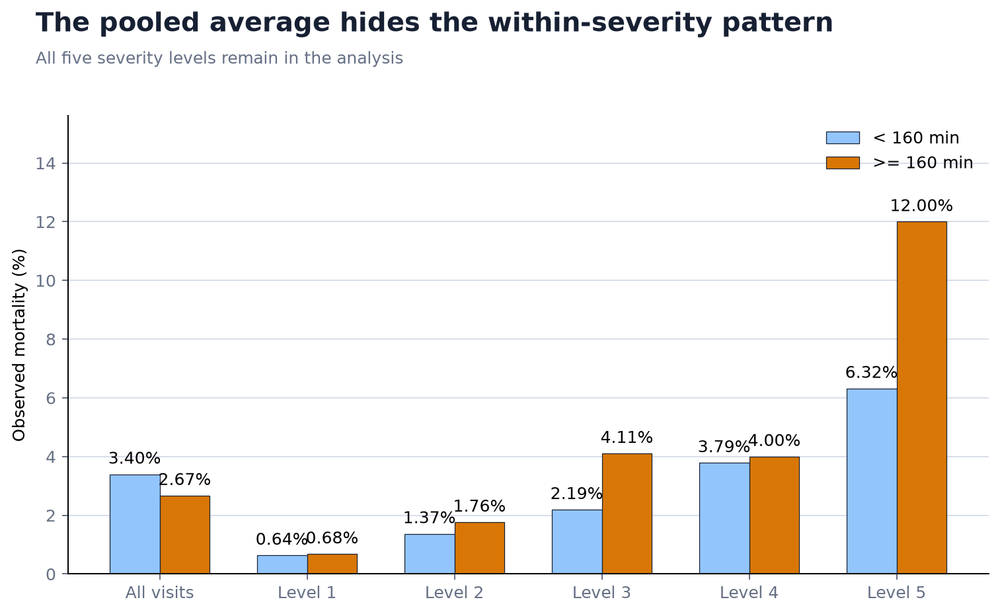
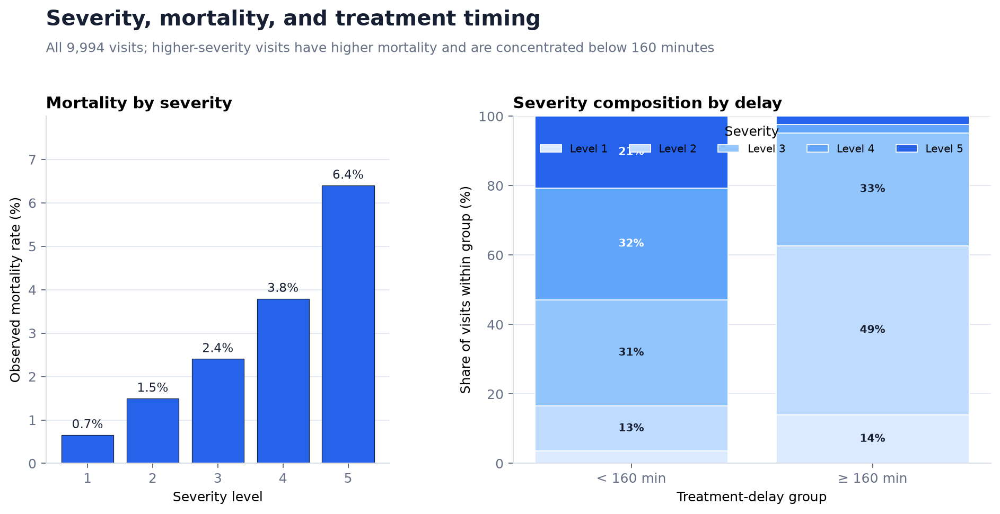
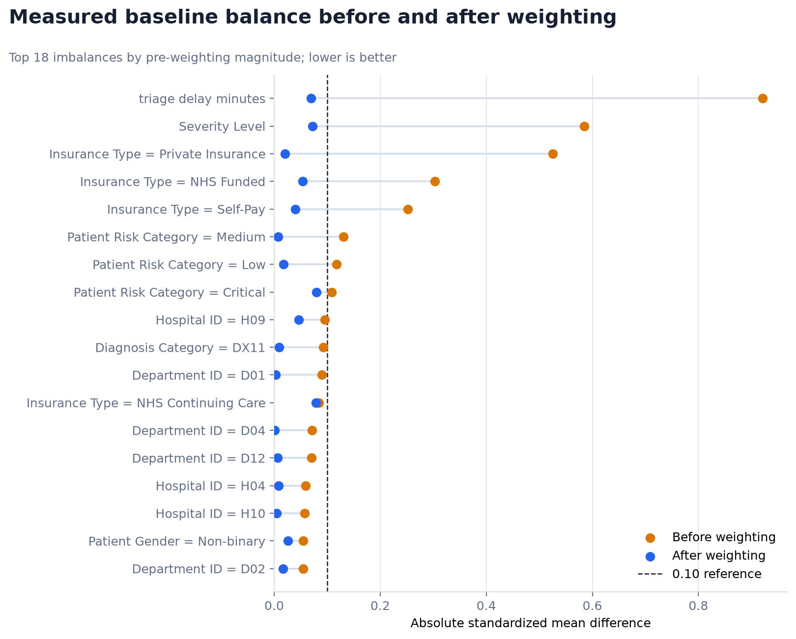
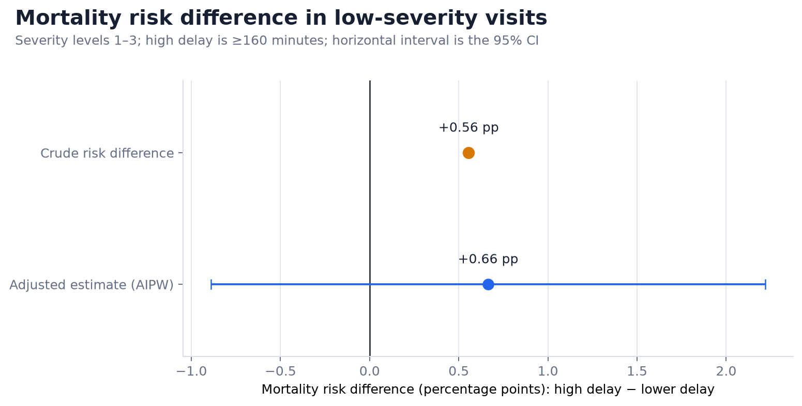
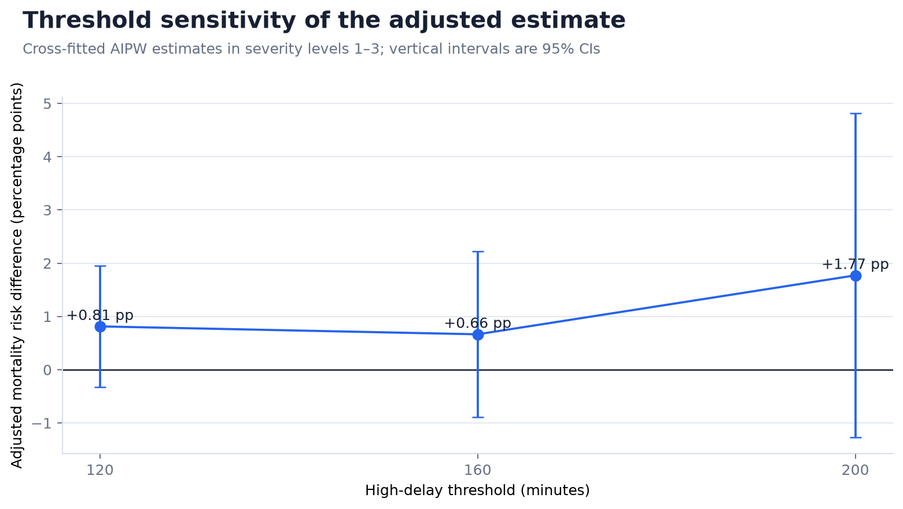

# Long treatment delays deserve attention—but 160 minutes is not a proven mortality threshold

**Stakeholder brief | 9,994 emergency-department visits | January 2024–December 2025**

## Executive Summary

- **The operational signal warrants attention.** Among 5,216 low-severity visits, the adjusted analysis estimates **0.66 additional deaths per 100 visits** when treatment begins at or after 160 minutes rather than sooner.
- **The evidence is not conclusive.** The 95% confidence interval ranges from **0.89 fewer to 2.22 additional deaths per 100 visits**, so the data remain compatible with no effect.
- **The raw dashboard comparison is misleading.** Across all visits, longer delay appears safer because the sickest patients are treated sooner. This is a practical example of Simpson's paradox.
- **Recommended decision:** monitor and reduce avoidable low-severity delays while validating the finding with better operational data. Do **not** treat 160 minutes as a clinically proven cutoff or use this analysis alone to change patient care.

## Situation — ED leaders need to understand whether long waits create avoidable risk

Treatment cannot always begin immediately, and emergency departments must prioritize the most urgent patients. The decision problem is therefore not “should every patient be treated in arrival order?” It is narrower:

> For patients already classified as low severity, is a long treatment delay associated with higher mortality after accounting for the factors that influence who waits?

The dataset covers 9,994 visits across 2024 and 2025. The primary analysis focuses on 5,216 visits at severity levels 1–3 and compares treatment starting **before 160 minutes** with treatment starting **at or after 160 minutes**. The 160-minute threshold is an operational scenario, not a validated clinical standard.

## Complication — the pooled average tells the wrong story

Across all visits, mortality appears *lower* in the high-delay group: **2.67% versus 3.40%**. After defining the low-severity population, the relationship reverses: mortality is **2.40% with high delay versus 1.85% with lower delay**.



*How to read this:* the left-hand comparison mixes patients with very different baseline risk. The right-hand comparison answers a narrower and more relevant operational question. The reversal is a warning that the overall average should not guide a delay policy.

Severity explains much of the contradiction. Mortality rises sharply across severity levels, while visits at levels 4–5 are concentrated in the shorter-delay group. Faster treatment therefore inherits more high-risk patients, making the pooled shorter-delay mortality rate look worse.



*So what:* descriptive statistics identify the bias but cannot remove it. A causal framework is needed to compare visits that were similar before treatment timing was determined.

## Question — would high delay increase mortality among comparable low-severity visits?

The working hypothesis is:

> Among otherwise comparable severity 1–3 visits, starting treatment at or after 160 minutes increases in-visit mortality risk relative to starting sooner.

| Decision element | Definition |
|---|---|
| Population | Severity levels 1–3 with complete required baseline data |
| Exposure | Treatment delay ≥160 minutes versus <160 minutes |
| Outcome | In-visit mortality |
| Primary measure | Average mortality risk difference in the eligible cohort |
| Comparison period | January 1, 2024–December 31, 2025 |

An RCT would provide the strongest protection against confounding, but deliberately assigning harmful delays may be unethical or infeasible. This study instead emulates a defined intervention contrast from observational data. It cannot reproduce randomization and remains dependent on measured covariates and causal assumptions.

## Evidence — adjustment preserves the risk signal, but uncertainty remains substantial

### 1. Propensity weighting made the observed groups more comparable

A propensity score estimates each visit's probability of experiencing high delay from information available before treatment. The analysis combines these scores with mortality outcome models in a **doubly robust AIPW estimator** and generates predictions out of sample using patient-grouped cross-fitting.

Before weighting, eight measured features exceeded the conventional absolute standardized mean difference threshold of 0.10. After weighting, only one remained at that boundary; the maximum imbalance fell from **0.921 to 0.100**.



*How to read this:* dots moving toward zero indicate that high- and lower-delay visits became more comparable on measured baseline characteristics. This improves the comparison, but it cannot balance factors that were not recorded.

### 2. The adjusted point estimate indicates possible harm, not proof

The crude mortality difference in the low-severity cohort is **+0.56 percentage points**. After doubly robust adjustment, the estimate is **+0.66 percentage points**. The adjusted interval crosses zero: **−0.89 to +2.22 percentage points**.



*How to read this:* values to the right of zero indicate higher mortality under high delay. The adjusted point lies to the right, but its confidence interval spans both sides of zero. The estimated direction is concerning; its magnitude is not precise enough for a definitive causal claim.

### 3. The direction is similar across thresholds, while precision deteriorates

Adjusted point estimates remain positive at 120, 160, and 200 minutes, but every confidence interval includes zero. The 200-minute estimate is especially imprecise because fewer visits support that comparison.



*So what:* the finding is not unique to one cutoff, but the sensitivity analysis does not establish a safe or harmful threshold. It supports continued investigation rather than a binary 160-minute rule.

## Answer — manage the operational risk and strengthen the evidence

The most defensible stakeholder conclusion is:

> Longer delays may increase mortality among low-severity ED visits, but this dataset does not establish that 160 minutes is a causal threshold. Reduce avoidable delay as a process-quality objective and collect the evidence needed for a decision-grade estimate.

Recommended next steps:

1. **Create a delay early-warning view.** Monitor median and 90th-percentile treatment delay by severity, hospital, department, and week; flag sustained movement toward 160 minutes before it becomes routine.
2. **Diagnose the treatment-start process.** Examine staffing coverage, queue transitions, room availability, handoffs, and whether lower-severity visits are unintentionally deprioritized after triage.
3. **Measure the missing confounders.** Add crowding, occupancy, staffing ratios, shift, day of week, arrival volume, and clinician-assessed urgency before re-estimating the effect.
4. **Evaluate operational improvements prospectively.** Predefine the cohort, outcomes, and estimand, then assess a feasible process intervention using a stepped rollout, interrupted time series, or another ethically appropriate design.
5. **Use mortality as a guardrail, not a weekly performance KPI.** Deaths are rare in this cohort; pair mortality with timelier process and safety outcomes while aggregating mortality over a stable review window.

## Further questions stakeholders should resolve

- Does the source data dictionary confirm that severity levels 1–3 are the intended low-severity population?
- Why was 160 minutes selected, and is there an external clinical or service-level benchmark?
- Do results persist after adding crowding, staffing, shift, and calendar-time measures?
- Which hospitals, departments, or time periods drive extreme propensity weights and residual imbalance?
- Would an operational intervention reduce delay without shifting risk to higher-severity patients?

## Caveats and assumptions

- The workbook's provenance, generation process, de-identification status, and public-use license have not been independently verified; raw data are excluded from this repository.
- Treatment timing was not randomized. AIPW addresses measured confounding only under consistency, positivity, correct time ordering, model adequacy, and no important unmeasured confounding.
- Mortality is rare in the eligible cohort: 102 deaths across 5,216 visits. This produces wide confidence intervals.
- Some propensities are near one: 14 values were clipped to `[0.01, 0.99]`, the 99th-percentile weight was 14.53, and the maximum weight was 100.
- Calendar time, staffing, crowding, and other operational conditions are not fully measured in the available model table.

## Analysis resources

- [Storytelling notebook](notebooks/low_severity_delay_causal_analysis.ipynb) — executable EDA, Simpson's paradox, propensity scores, and doubly robust estimation
- [Methodology](reports/methodology.md) — estimand, cohort, covariates, assumptions, and uncertainty
- [Validation report](reports/validation_report.md) — implementation issues corrected and remaining limitations
- [Results snapshot](reports/results.md) — aggregate numerical results
- [Chart map](reports/chart_map.md) — visual evidence and design rationale

<details>
<summary><strong>Reproduce the analysis</strong></summary>

```bash
python -m venv .venv

# Windows
.venv\Scripts\activate

# macOS / Linux
source .venv/bin/activate

pip install -r requirements.txt
python analysis.py --input data/raw/mortality.xlsx
python -m unittest discover -s tests -v
```

The script regenerates aggregate results and figures without exporting row-level patient data.

</details>

<details>
<summary><strong>Repository structure</strong></summary>

```text
.
├── analysis.py                 # reproducible causal analysis
├── data/                       # data contract; raw workbook ignored by Git
├── figures/                    # aggregate stakeholder visuals
├── notebooks/                  # executed storytelling notebook
├── reports/                    # methods, results, validation, chart map
├── results/                    # machine-readable aggregate outputs
└── tests/                      # deterministic utility tests
```

</details>

## References

- [STROBE reporting guidance for observational studies](https://www.strobe-statement.org/)
- Hernán MA, Robins JM. [*Causal Inference: What If*](https://www.hsph.harvard.edu/miguel-hernan/wp-content/uploads/sites/1268/2024/04/hernanrobins_WhatIf_26apr24.pdf)
- Austin PC, Stuart EA. [Moving towards best practice when using inverse probability of treatment weighting](https://pmc.ncbi.nlm.nih.gov/articles/PMC4626409/)
- Zhong Y, et al. [AIPW: augmented inverse probability-weighted estimation of average causal effects](https://pmc.ncbi.nlm.nih.gov/articles/PMC8796813/)

> **Responsible use:** This repository is an analytical portfolio project, not clinical guidance. Validate the source data, clinical definitions, causal assumptions, and model specification with domain experts before using the findings for patient-care or operational decisions.
